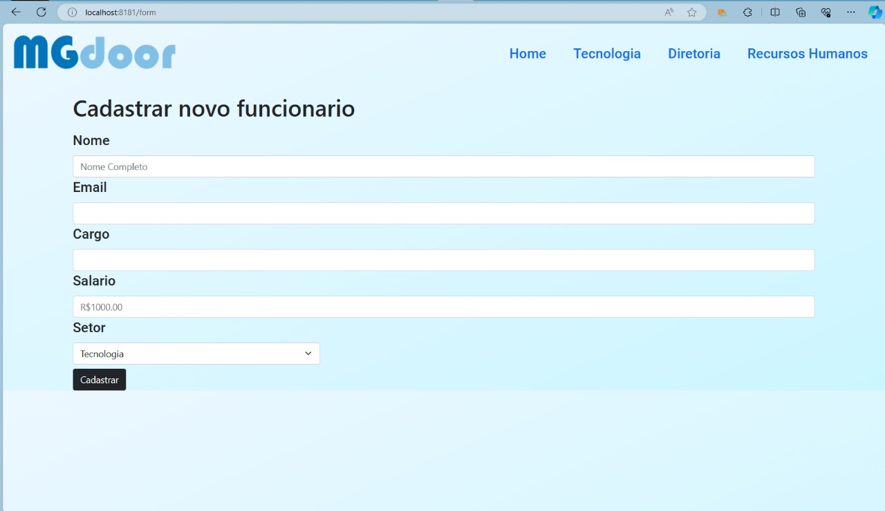

# Projeto de Aplicativo CRUD com Spring Boot, MySQL, Thymeleaf e Bootstrap

Neste projeto, vamos criar um aplicativo web simples, mas muito educativo, que realiza operações CRUD (Create, Read, Update, Delete) em um banco de dados usando as seguintes tecnologias: Spring Boot, MySQL, Thymeleaf e Bootstrap. 🚀

## Objetivo

O objetivo deste projeto é aprender e praticar a criação de um aplicativo web básico que possa realizar as operações CRUD em um banco de dados, usando um conjunto de tecnologias populares. Isso nos permitirá entender a estrutura do Spring Boot, o funcionamento do MySQL, a integração com Thymeleaf para a camada de visualização e o uso do Bootstrap para melhorar o design e a experiência do usuário. 📚

## Tecnologias Utilizadas

- **Spring Boot**: O Spring Boot é um framework Java que simplifica o desenvolvimento de aplicativos web, oferecendo configurações padrão e um ambiente de execução integrado. 🔧

- **MySQL**: O MySQL é um sistema de gerenciamento de banco de dados relacional amplamente utilizado para armazenamento de dados. 🗃️

- **Thymeleaf**: Thymeleaf é um mecanismo de template que nos permite criar páginas HTML dinâmicas e incorporar dados diretamente em nossos modelos. 🌐

- **Bootstrap**: O Bootstrap é um framework de design front-end que permite criar interfaces de usuário atraentes e responsivas de forma eficiente. 🎨

## Funcionalidades do Projeto

O aplicativo realizará as quatro operações CRUD:

1. **Create (Criar)**: Os usuários poderão adicionar novos registros ao banco de dados, preenchendo um formulário. ➕

2. **Read (Ler)**: Os registros existentes serão exibidos em uma lista na interface do aplicativo, permitindo a visualização dos dados. 👀

3. **Update (Atualizar)**: Os usuários poderão editar registros existentes, atualizando os campos conforme necessário. 📝

4. **Delete (Excluir)**: Registros podem ser excluídos da base de dados. 🗑️

## Arquitetura

O projeto seguirá o padrão de arquitetura MVC (Model-View-Controller):

- **Model**: Lida com a lógica de negócios e a interação com o banco de dados. 🧠

- **View**: Usa Thymeleaf e Bootstrap para criar a interface do usuário atraente e responsiva. 🖥️

- **Controller**: Gerencia as solicitações do usuário, chama a lógica de negócios apropriada e atualiza a interface do usuário. 🕹️

## Aprendizado

Ao criar este aplicativo, você ganhará conhecimento em:

- Configuração do ambiente de desenvolvimento com Spring Boot. ⚙️

- Modelagem de banco de dados e operações SQL com MySQL. 📊

- Criação de páginas dinâmicas usando Thymeleaf. 📲

- Design de interface de usuário responsiva com Bootstrap. 📱

- Implementação do padrão MVC para uma organização clara do código. 📦

- Testes para garantir a qualidade do código. 🧪

- Integração contínua para automação de construção e implantação. 🔄

## Próximos Passos

Este projeto serve como uma excelente base para futuros desenvolvimentos. Você pode expandir suas funcionalidades, adicionar recursos de segurança e continuar aprimorando o design com o uso do Bootstrap. 📈

Fique à vontade para entrar em contato para saber mais sobre o projeto e compartilhar suas ideias ou dúvidas. Vamos continuar aprendendo e crescendo juntos! 🤝

[LinkedIn](seu-linkedin-aqui) 🔗
